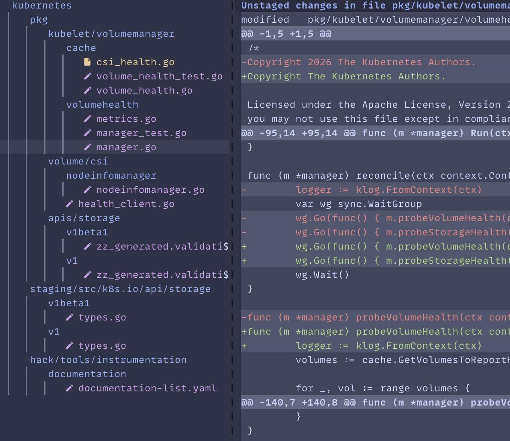
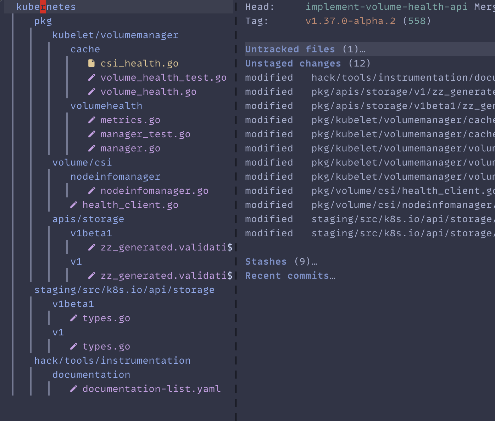

# treemacs-magit

An Emacs package that displays Git changes as a [Treemacs](https://github.com/Alexander-Miller/treemacs) tree, built on top of [Magit](https://magit.vc/).

## What it does

`treemacs-magit-mode` opens a Treemacs side buffer showing the files that have changed in the current Git repository. It can also show the files changed by a specific commit when invoked from a Magit revision or log buffer.

Files are grouped into a collapsible directory tree. Changed files are annotated with Nerd Font status icons (configurable):

- `󰈔` — `untracked`: new files not yet tracked by Git
- `󰏫` — `unstaged`: modified files with unstaged changes
- `󰄬` — `staged`: changes added to the index
- `󰏫󰄬` — `both`: files with both staged and unstaged changes
- *(no icon)* — `committed`: files changed by the commit under review

Deep directory chains with a single child are automatically folded into a single `parent/child` node to keep the tree compact (see `treemacs-magit-fold-min-depth`).

## AI Slop ahead

Fair warning, this code was generated using LLMs. The plugin works and serves my needs but apart
from carefully revieweing the UI, I haven't deeply reviewed the code.

## Screenshots





## Dependencies

- Emacs
- [magit](https://github.com/magit/magit)
- [treemacs](https://github.com/Alexander-Miller/treemacs)
- `treemacs-treelib` (bundled with Treemacs)

## Installation

### With `straight.el`

```elisp
(straight-use-package
  '(treemacs-magit-mode :type git :host github :repo "gnufied/treeview-magit"))
```

With `use-package` and `straight.el`:

```elisp
(use-package treemacs-magit-mode
  :straight (treemacs-magit-mode :type git :host github :repo "gnufied/treeview-magit")
  :commands (treemacs-magit))
```

### Manual

Clone this repository and add it to your `load-path`:

```elisp
(add-to-list 'load-path "/path/to/treeview-magit")
(require 'treemacs-magit-mode)
```

### With `use-package` (manual load-path)

```elisp
(use-package treemacs-magit-mode
  :load-path "/path/to/treeview-magit"
  :commands (treemacs-magit))
```

## Usage

Run `M-x treemacs-magit` from a buffer inside a Git repository to open a Treemacs view of all changed files.

When point is on a commit in a `magit-revision-mode` or `magit-log-mode` buffer, `M-x treemacs-magit` shows the files touched by that commit instead.

### Default key bindings

| Key | Action |
| --- | --- |
| `RET` | Open the diff for the file at point |
| `S-RET` | Visit the file itself |
| `s` | Toggle staging for the file at point (stages unstaged files, unstages staged files) |
| `q` | Quit and kill the buffer |
| `<mouse-1>` | Open the diff for the clicked file |
| `C-<mouse-1>` | Visit the clicked file |

The package tries to reuse the window immediately to the right of the tree for diffs. If a third vertical window is available, file contents are shown there; otherwise the diff window is reused.

## Configuration

### Directory folding

```elisp
;; Fold single-child directory chains deeper than this many levels.
;; Set to nil to disable folding entirely.
(setq treemacs-magit-fold-min-depth 3)
```

### Status icons

Icons require a [Nerd Font](https://www.nerdfonts.com/) in your terminal or GUI Emacs.

```elisp
;; Customize the icon for each status.  Set a value to "" to hide it.
(setq treemacs-magit-status-icons
      '((unstaged  . "󰏫")
        (staged    . "󰄬")
        (both      . "󰏫󰄬")
        (untracked . "󰈔")))

;; Show icons before the file name (prefix), after it (suffix), or not at all (none).
(setq treemacs-magit-status-icon-position 'prefix)

;; Text inserted between the icon and the file name.
(setq treemacs-magit-status-icon-separator " ")
```

## License

See the source file for license information.
