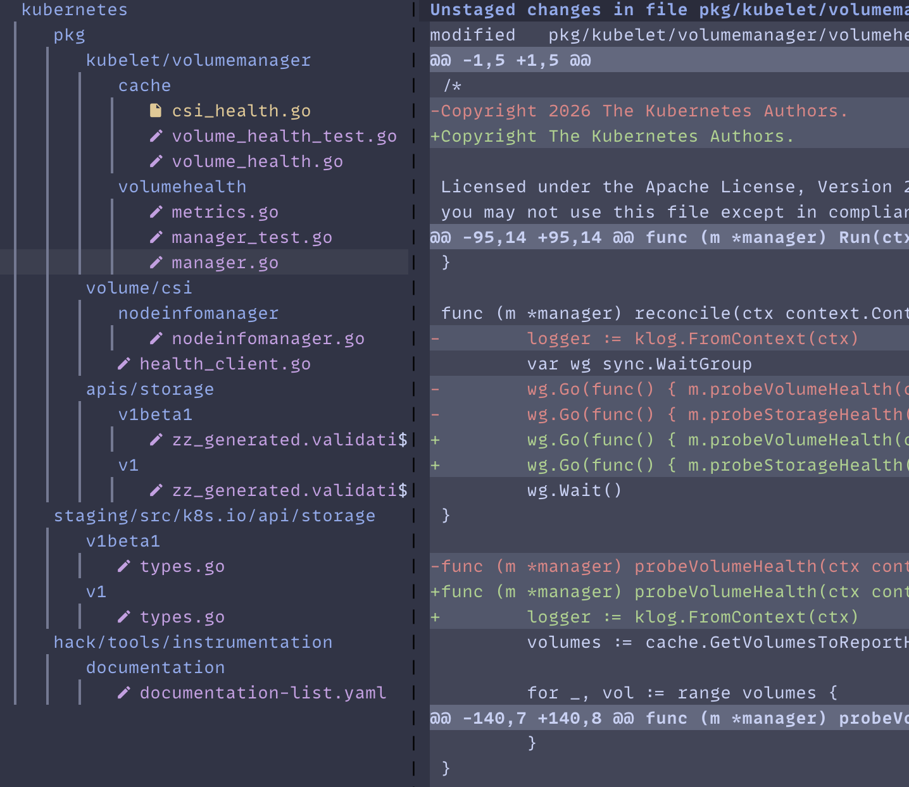
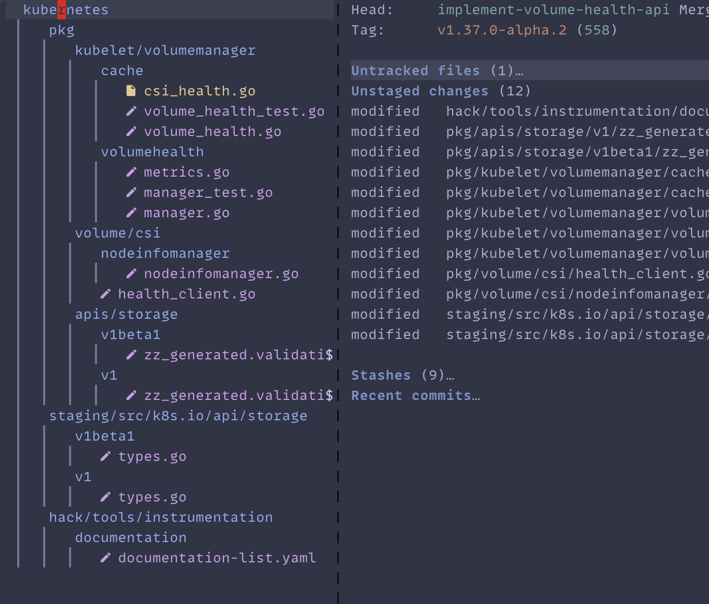

# treemacs-magit

An Emacs package that displays Git changes as a [Treemacs](https://github.com/Alexander-Miller/treemacs) tree, built on top of [Magit](https://magit.vc/).

## What it does

`treemacs-magit-mode` opens a Treemacs side buffer showing the files that have changed in the current Git repository. It can also show the files changed by a specific commit, the current branch compared with another branch, or all files changed by a GitHub pull request.

Files are grouped into a collapsible directory tree. Changed files are annotated with Nerd Font status icons (configurable):

- `󰈔` — `untracked`: new files not yet tracked by Git
- `󰏫` — `unstaged`: modified files with unstaged changes
- `󰄬` — `staged`: changes added to the index
- `󰏫󰄬` — `both`: files with both staged and unstaged changes
- *(no icon)* — `committed`: files changed by the commit under review

Deep directory chains with a single child are automatically folded into a single `parent/child` node to keep the tree compact (see `treemacs-magit-fold-min-depth`).

## AI Slop ahead

Fair warning, this code was generated using LLMs. The plugin works and serves my needs but apart
from carefully revieweing the UI, I haven't deeply reviewed the code.

## Screenshots





## Dependencies

- Emacs
- [magit](https://github.com/magit/magit)
- [treemacs](https://github.com/Alexander-Miller/treemacs)
- `treemacs-treelib` (bundled with Treemacs)
- [GitHub CLI](https://cli.github.com/) and the `sake prc` helper for pull request views

## Installation

### With `straight.el`

```elisp
(straight-use-package
  '(treemacs-magit-mode :type git :host github :repo "gnufied/treeview-magit"))
```

With `use-package` and `straight.el`:

```elisp
(use-package treemacs-magit-mode
  :straight (treemacs-magit-mode :type git :host github :repo "gnufied/treeview-magit")
  :commands (treemacs-magit treemacs-magit-branch treemacs-magit-pr))
```

### Manual

Clone this repository and add it to your `load-path`:

```elisp
(add-to-list 'load-path "/path/to/treeview-magit")
(require 'treemacs-magit-mode)
```

### With `use-package` (manual load-path)

```elisp
(use-package treemacs-magit-mode
  :load-path "/path/to/treeview-magit"
  :commands (treemacs-magit treemacs-magit-branch treemacs-magit-pr))
```

## Usage

Run `M-x treemacs-magit` from a buffer inside a Git repository to open a Treemacs view of all changed files.

When point is on a commit in a `magit-revision-mode` or `magit-log-mode` buffer, `M-x treemacs-magit` shows the files touched by that commit instead.

Run `M-x treemacs-magit-branch` and choose a local or remote branch to compare it with the currently checked-out branch. The command uses Git's three-dot range semantics, showing changes on the current branch since the branches' merge base. It does not check out or modify either branch. Selecting the root shows the complete range diff, and selecting a file shows its range diff.

Run `M-x treemacs-magit-pr` from a Git repository to show the pull request associated with the current branch. GitHub CLI resolves that association from the branch, so another locally stored PR number is unnecessary. If the exact PR head is already checked out, checkout is skipped.

Use `C-u M-x treemacs-magit-pr` to enter a different pull request number. When switching is needed, the command runs `sake prc NUMBER` (the executable behind the shell alias `s prc`). The worktree must be clean before switching branches.

The local `prc` helper passes `--force` to `gh pr checkout`. A clean existing
local branch with the same name may therefore be reset to the PR head.

Pull request diffs use GitHub's base and head commit IDs with Git's three-dot range semantics. Selecting the root shows the complete PR diff; selecting a file shows only that file's PR diff.

Visiting a file from a pull request tree opens the checked-out worktree file,
so the buffer remains writable and language tooling such as LSP can run
normally. Deleted files, which have no worktree copy, fall back to a read-only
Magit blob. Ordinary commit views continue to use read-only commit blobs.

### Default key bindings

| Key | Action |
| --- | --- |
| `RET` | Open the diff for the file at point |
| `S-RET` | Visit the file itself |
| `c` | Commit the currently staged changes |
| `s` | Toggle staging for the file at point (stages unstaged files, unstages staged files) |
| `q` | Quit and kill the buffer |
| `<mouse-1>` | Open the diff for the clicked file |
| `C-<mouse-1>` | Visit the clicked file |

The tree window is dedicated to the Treemacs Magit buffer, so commands that
display another buffer use a different window instead of replacing the tree.
The first changed file is selected automatically. On a wide frame its diff is
shown in the middle window and its contents in the rightmost window. When there
is not enough width for both content windows, only the diff is shown beside the
tree. Subsequent diff and file visits reuse those same windows.

## Configuration

### Adaptive window layout

Terminal and graphical Emacs frames are measured in character columns. A
third window is created only when each of the two content windows can be at
least this wide:

```elisp
(setq treemacs-magit-min-content-window-width 50)
```

### Large pull request directories

Pull request trees collapse changed files under configured root-relative directories. The default keeps `vendor` as one intentionally empty directory node, so its potentially large subtree is never built. This affects PR views only.

```elisp
;; Each entry is relative to the repository root.
(setq treemacs-magit-pr-collapsed-directories '("vendor" "third_party/generated"))

;; Build every changed path in the PR tree.
(setq treemacs-magit-pr-collapsed-directories nil)
```

The checkout helper defaults to the `sake` executable found on `PATH`. If needed, set its absolute path:

```elisp
(setq treemacs-magit-pr-checkout-program "/home/hekumar/bin/sake")
```

When the PR head is not already checked out, `treemacs-magit-pr` refuses to
continue if the worktree has uncommitted changes.  Otherwise it runs the
helper, whose `gh pr checkout --force` command may reset an existing local
branch with the same name to the PR head.

### Directory folding

```elisp
;; Fold single-child directory chains deeper than this many levels.
;; Set to nil to disable folding entirely.
(setq treemacs-magit-fold-min-depth 3)
```

### Status icons

Icons require a [Nerd Font](https://www.nerdfonts.com/) in your terminal or GUI Emacs.

```elisp
;; Customize the icon for each status.  Set a value to "" to hide it.
(setq treemacs-magit-status-icons
      '((unstaged  . "󰏫")
        (staged    . "󰄬")
        (both      . "󰏫󰄬")
        (untracked . "󰈔")))

;; Show icons before the file name (prefix), after it (suffix), or not at all (none).
(setq treemacs-magit-status-icon-position 'prefix)

;; Text inserted between the icon and the file name.
(setq treemacs-magit-status-icon-separator " ")
```

## License

See the source file for license information.
